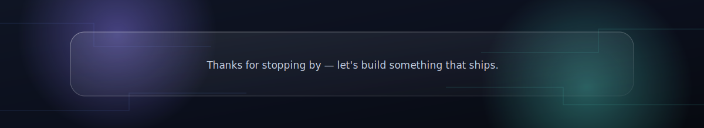

<div align="center">




<br/>


<br/><br/>

<a href="https://linkedin.com/in/brianhexer"></a>
<a href="https://github.com/brianhexer"></a>
<a href="https://x.com/brianhexer"></a>
<a href="mailto:brianhexer@gmail.com"></a>
<a href="https://brianhexer.hepthex.com"></a>
<a href="https://hepthex.com"></a>
<a href="https://orcid.org/0009-0009-2561-941X"></a>

<br/><br/>


<br/>

<p>
<a href="#01--profile"></a>
<a href="#02--hepthex"></a>
<a href="#03--technical-stack"></a>
<a href="#04--experience"></a>
<a href="#05--education"></a>
<a href="#06--featured-projects"></a>
<a href="#07--certifications"></a>
<a href="#08--publications"></a>
<a href="#09--leadership--community"></a>
<a href="#10--github-analytics"></a>
<a href="#11--connect"></a>
</p>

</div>

<br/>

## 01 · Profile

```yaml
name: Deepan P
role: Full-Stack Developer · VLSI/AI-ML Engineer · Founder, HEPTHEX
location: Coimbatore, Tamil Nadu, India
education: B.E. Electronics & Communication Engineering, Karpagam Academy of Higher Education (2022–2026)
status: Graduated · open to full-time Full-Stack and AI/ML Engineer roles, and freelance/studio work
research: TEEP research internship at National Dong Hwa University, Taiwan — AI/ML, AIoT, quantum computing
building: HEPTHEX — a global creative technology studio and agency
focus: [Full-Stack Web Development, VLSI Design & Verification, Embedded Systems, AIoT, AI/ML, Deepfake Detection, Robotics]
```

I'm an engineer who works comfortably on both sides of the stack — from RTL-level chip verification to production web applications and applied machine learning. That range comes from an academic path through VLSI and embedded systems, a research stint applying AI/ML to AIoT problems abroad, and several years shipping client and personal projects through HEPTHEX. I'm currently looking for a full-time role as a Full-Stack Developer or AI/ML Engineer, and taking on select freelance and studio projects alongside that search.

<table>
<tr>
<td width="50%" valign="top">

**Contact**
- Email: brianhexer@gmail.com
- Phone: +91 638-251-7017
- Portfolio: brianhexer.hepthex.com
- ORCID: [0009-0009-2561-941X](https://orcid.org/0009-0009-2561-941X)

</td>
<td width="50%" valign="top">

**Currently**
- Interviewing for Full-Stack Developer and AI/ML Engineer positions
- Running HEPTHEX on the side, open to freelance and studio builds
- Deepening research in AI/ML, AIoT, and quantum computing
- Happy to talk React, PHP/MySQL systems, SystemVerilog, or AIoT

</td>
</tr>
</table>

<div align="right"><a href="#readmemd">↑ back to top</a></div>

<br/>

## 02 · HEPTHEX

<div align="center">

<br/><br/>

<br/>
<sub><b>A global creative technology company — studio and agency</b></sub>
<br/><br/>
<a href="https://hepthex.com"></a>
</div>

<br/>

> HEPTHEX designs and builds digital products for startups, SMEs, and enterprises — from fast marketing sites to production-grade applications. It's part studio, part agency, with a small multidisciplinary team handling everything from ideation through deployment.

<table>
<tr>
<td width="25%" align="center">

**Websites & Web Apps**
<sub>Fast, responsive, production-ready</sub>

</td>
<td width="25%" align="center">

**Enterprise Applications**
<sub>Scalable systems built to last</sub>

</td>
<td width="25%" align="center">

**Product & Brand Design**
<sub>Identity that performs</sub>

</td>
<td width="25%" align="center">

**Ideation → Deployment**
<sub>End-to-end delivery</sub>

</td>
</tr>
</table>

<div align="center">
<sub>Role at HEPTHEX: <b>Founder</b> · Engagement: <b>freelance / studio projects</b> · runs alongside my search for a full-time Full-Stack or AI/ML role</sub>
</div>

<div align="right"><a href="#readmemd">↑ back to top</a></div>

<br/>

## 03 · Technical Stack

<div align="center">

**Languages**


**Frontend**


**Backend & Databases**


**AI/ML & Hardware**


**Cloud, DevOps & Research Tools**


**Design & Multimedia**


</div>

<div align="right"><a href="#readmemd">↑ back to top</a></div>

<br/>

## 04 · Experience

<table>
<tr><th>Role</th><th>Organization</th><th>Duration</th></tr>
<tr><td>TEEP Research Intern — AI/ML, AIoT, Quantum Computing</td><td>Dept. of Physics, National Dong Hwa University, Taiwan — with Prof. Jen-Yeu Chen, Dept. of Electrical Engineering</td><td>Aug 2025 – Feb 2026</td></tr>
<tr><td>Robotics Operator & Technical Support Engineer — Intern</td><td>ROBOMIRACLE, Coimbatore</td><td>May – Jul 2025</td></tr>
<tr><td>Skill Development Program — Autonomous Robotics</td><td>Karpagam Academy of Higher Education, Coimbatore</td><td>Apr 2024</td></tr>
<tr><td>Embedded Systems with IoT — Internship</td><td>Coimbatore</td><td>Dec 2023</td></tr>
</table>

```text
2025 ─Aug──────────────────────────Feb─ 2026   TEEP Research Internship, NDHU Taiwan
2025 ─May──Jul─                                Robotics Operator & Tech Support, ROBOMIRACLE
2024 ─Apr─                                     Autonomous Robotics Skill Program, KAHE
2023 ─Dec─                                     Embedded Systems with IoT Internship
```

<div align="right"><a href="#readmemd">↑ back to top</a></div>

<br/>

## 05 · Education

**Karpagam Academy of Higher Education** — Coimbatore, Tamil Nadu
Bachelor of Engineering, Electronics and Communication Engineering · Sep 2022 – Mar 2026

Coursework: VLSI Design · Embedded Systems · IoT Applications · AI & Machine Learning · Autonomous Robotics · Digital Architecture · Chip-Level Simulations · Quantum Computing · SystemVerilog · UVM · Circuit Design · Drone Technology

<div align="right"><a href="#readmemd">↑ back to top</a></div>

<br/>

## 06 · Featured Projects

<table>
<tr>
<td width="50%">

**DeepFakeVigilant**
`Deep Learning` `CNN` `ELA` `GAN`
A fusion AI platform combining CNN, error-level analysis, and GAN-based detection with semantic consistency checks for full-video deepfake detection, reaching 99.2% accuracy.

</td>
<td width="50%">

**Mandarin Guide Web App**
`Full-Stack` `PWA` `Offline-First`
An offline-capable progressive web app with 36 interactive modules built to help international students learn Mandarin.

</td>
</tr>
<tr>
<td width="50%">

**AIoT Smart Animal Repellent System**
`AIoT` `Computer Vision` `Edge Computing`
A YOLO-based repellent system for agricultural fields, achieving 98% macaque recognition accuracy on edge hardware.

</td>
<td width="50%">

**IoT-Based Futuristic Energy Meter**
`IoT` `Cloud Analytics` `Smart Grid`
A cloud-connected energy monitoring dashboard for remote tracking and load control, recognized at Smart India Hackathon 2023.

</td>
</tr>
<tr>
<td width="50%">

**Smart Farming System Using IoT**
`IoT` `Automation` `Agriculture`
A precision-farming system with sensor-driven automated irrigation designed to optimize crop yields.

</td>
<td width="50%">

**Surveillance and Security Drone**
`AI` `Deep Learning` `Computer Vision`
An autonomous drone built for real-time threat detection, live streaming, and anomaly alerts.

</td>
</tr>
<tr>
<td width="50%">

**Line Following Robot**
`Autonomous Robotics` `Sensor Integration`
A sensor-integrated autonomous robot built for consistent line tracking and reliable obstacle avoidance.

</td>
<td width="50%" valign="middle" align="center">

<sub><a href="https://github.com/brianhexer?tab=repositories">→ Explore the full repository archive</a></sub>

</td>
</tr>
</table>

<div align="right"><a href="#readmemd">↑ back to top</a></div>

<br/>

## 07 · Certifications

<details open>
<summary><b>View all certifications</b></summary>
<br/>

| Certification | Issuer | Focus |
|---|---|---|
| Blended VLSI Design Course | Maven Silicon | Digital architecture, chip-level simulations, SystemVerilog |
| Blended VLSI Verification | Maven Silicon | Chip-level verification, UVM, SystemVerilog |
| VLSI and Embedded Systems (Feb 2024) | TESSOLVE | VLSI design/verification, embedded systems |
| Autonomous Robotics Skill Program (Apr 2024) | Karpagam Academy of Higher Education | Autonomous navigation, robotics programming, sensor integration |
| Advanced Circuit Design Techniques (2023) | Workshop | Circuit design fundamentals |
| TOCFL — Novice 1 (Jun 2024) | Mandarin Chinese | Language proficiency |
| EF SET — 71/100, CEFR C2 Proficient | English | Language proficiency |

</details>

<div align="right"><a href="#readmemd">↑ back to top</a></div>

<br/>

## 08 · Publications

- **"IoT Applications in Smart Agriculture"** — ICCSICE '24 · sustainable farming enhanced through IoT technologies
- **"Surveillance and Security Drone"** — ICCSICE '24 · AI and computer vision integrated for autonomous security drones
- **"Paper on Security and Drainage Systems"** — RTES '23 · smart infrastructure proposals for urban safety and efficiency

<div align="right"><a href="#readmemd">↑ back to top</a></div>

<br/>

## 09 · Leadership & Community

- Web & Tech Committee Member — Rotaract South Asia Multi District Information Organisation (RY 2026–2027)
- Past President / Club Advisor — Rotaract Club of Coimbatore City (RY 2026–2027)
- Immediate Past President / Club Advisor / Web & Tech Administrator — Rotaract Club of Coimbatore City (RY 2025–2026)
- President — Rotaract Club of Coimbatore City (RY 2024–2025)
- Treasurer — Rotaract Club of Karpagam Academy of Higher Education (RY 2023–2024)
- Special Invitee & Member — Institutional Student Grievance Redressal Committee, KAHE (2024–2026)
- Organizer — TRONIX 2k24/2k25 (tech fests), PRANAYA 2k24/2k25 (national cultural festivals)
- Outside of work: badminton, chess, cricket, football

<div align="right"><a href="#readmemd">↑ back to top</a></div>

<br/>

## 10 · GitHub Analytics

<div align="center">


</div>

<details open>
<summary><b>Contribution Activity Graph</b></summary>
<br/>


</details>

<details>
<summary><b>3D Contribution Calendar</b></summary>
<br/>

<picture>
  <source media="(prefers-color-scheme: dark)" srcset="https://raw.githubusercontent.com/brianhexer/brianhexer/main/profile-3d-contrib/profile-night-rainbow.svg">
  
</picture>

<sub>Powered by <a href="https://github.com/yoshi389111/github-profile-3d-contrib">yoshi389111/github-profile-3d-contrib</a> — add the workflow to your profile repo to auto-generate this graphic.</sub>

</details>

<details>
<summary><b>Contribution Snake</b></summary>
<br/>


<sub>Powered by <a href="https://github.com/Platane/snk">Platane/snk</a> — add the workflow to your profile repo to auto-generate this animation.</sub>

</details>

<div align="right"><a href="#readmemd">↑ back to top</a></div>

<br/>

## 11 · Connect

<div align="center">


<br/>

[](https://discord.gg/brianhexer)
[](https://facebook.com/brianhexer)
[](https://instagram.com/brian_offl)
[](https://youtube.com/@brianhexer)

</div>

### Support the Work

<div align="center">

[](https://buymeacoffee.com/brianhexer)
[](https://paypal.me/BrianHexer)
[](https://patreon.com/BrianHexer)
[](https://ko-fi.com/brianhexer)

</div>

<br/>

<div align="center">


<br/><br/>



<sub>Designed with a liquid-glass aesthetic over a circuit-trace backdrop — a nod to the hardware roots behind the software.</sub>

</div>
